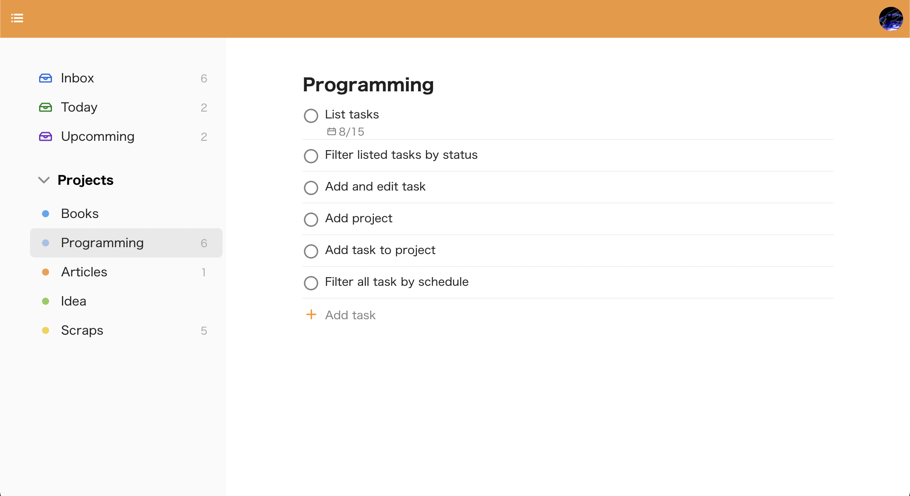

# Todoist clone

React、TypeScript、Firebase を使って作った、人気のタスク管理アプリである Todoist のクローンです。



https://altech-todoist.web.app/

## Technologies

- Language: TypeScript
- UI Library: React 17
- Backend: Firebase (Cloud Firestore, Authentication, Hosting)
- Firebase SDK: [v9 - modular version](https://firebase.google.com/docs/web/learn-more#modular-version)
- Module Bundler: Snowpack
- CSS: styled-components

## Spec

### Features

- Sign Up
- Sign In
- Sign Out
- List tasks
- Add a task to inbox
- Edit a task
- Delete a task
- Mark task as done
- Schedule a task
- List projects
- Add a project
- Add a task to a project
- List tasks of a project
- Filter all tasks by schedule

## Setup

Firebase のクレデンシャルは既にリポジトリに含まれているので、ローカルで動かすための最小のセットアップ手順は以下になります。

```
$ yarn
$ yarn start
```

バックエンドも差し替えるためには、アカウントを作って `src/firebaase.ts` を変更してください。
